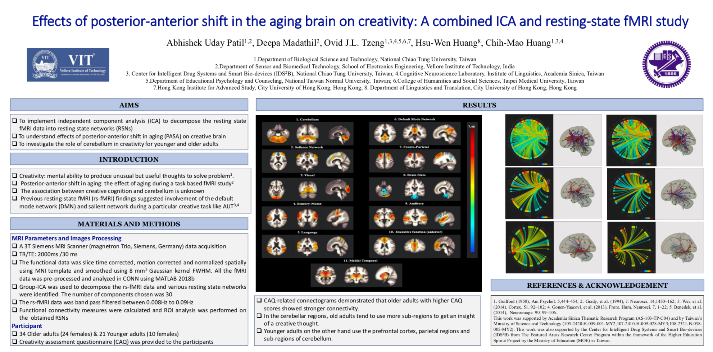
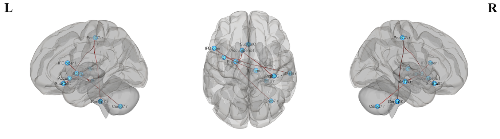
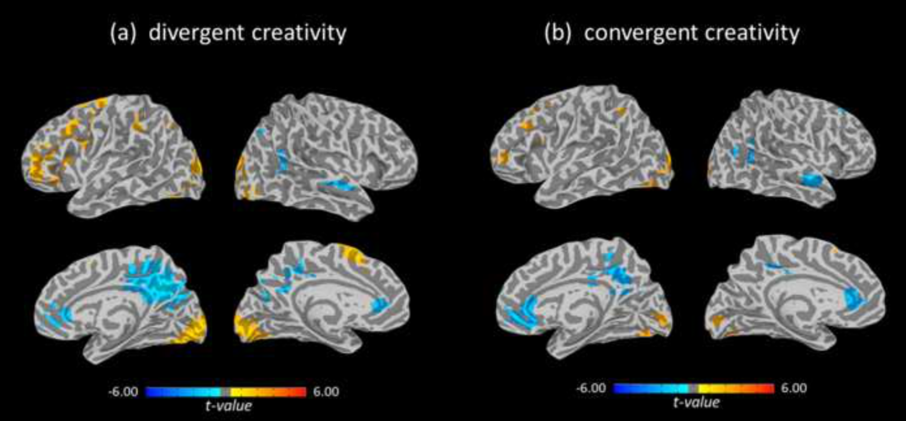

## News

---

## Publications

- 
 <b>A. U. Patil</b>, A. Dube, R. K. Jain, G. D. Jindal, and D. Madathil, “Classification and comparative analysis of control and migraine subjects using eeg signals,” in Information Systems Design and Intelligent Applications. Springer, 2019, pp. 31–39.

- 
 Rajesh Kumar Jain, Sushma N Bhat, Amitabh Dube, <b>Abhishek Patil</b>, Vidhi Jain, G.D Jindal, "Web-based portal for database and analysis of physiological variability", Conference proceedings of International Conference on Computing, Communication and Control Technology (IC4T 2018), held at Ram Swaroop Memorial University (SRMU). Lucknow. (2018) pp:6-9.

- 
 Jyoti Warrier, Sushma Bhat, Nishant Patil, <b>"Handbook on "Biosignals: Acquisition and Processing""</b>, at National Workshop on Biosignals:Acquision and Processing held at MGM College of Engineering, Navi-Mumbai.(2015).

---

## Ongoing Projects 

[Effects of posterior-anterior shift in the aging brain on creativity: A combined ICA and resting-state fMRI study](/pdf/CNS_poster.pdf)

[Internet addiction levels alter the functional connectivity of executive networks in the creative brain](/sample_page2)

---

### Completed Projects

[Dynamic interaction of functional brain connectivity in convergent and divergent creativity](/sample_page)

---

### Collaborators

- <a href="https://huangslab.weebly.com" target="_blank" >Dr. Chih-Mao Huang</a> - <a href="https://www.nctu.edu.tw" target="_blank" >NCTU, Taiwan</a>
- <a href= "http://lt.cityu.edu.hk/People/Peop_peopleProfile.asp?peop_StfID=1009&peop_rkcl=1" target="_blank">Dr. Hsu-Wen Huang</a>- <a href="lt.cityu.edu.hk" target="_blank" >CityU, Hong Kong</a>

Page template forked from evanca</a>

<!-- Remove above link if you don't want to attibute -->
